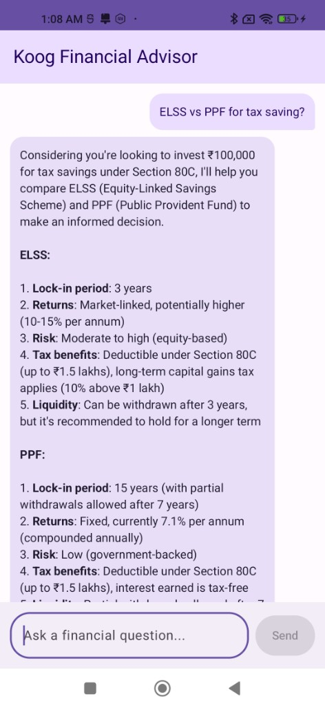
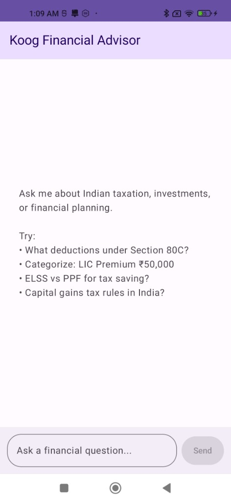

# Koog Agent

An Android app that acts as a financial advisor using an AI agent built entirely in Kotlin. It answers tax-related queries, categorizes transactions, and suggests investment strategies -- powered by JetBrains' Koog agent framework and Groq API.

I built this to explore how Kotlin developers can build AI-powered apps without switching to Python or picking up ML frameworks. Koog handles the agent orchestration and tool calling natively in Kotlin, so the only new concept is the agent pattern itself.

## Screenshots

<p align="center">
  
  &nbsp;&nbsp;&nbsp;
  
</p>

## What it does

- Answers Indian tax queries (Section 80C, 80D, capital gains, old vs new regime)
- Categorizes financial transactions and maps them to relevant tax deductions
- Suggests investment strategies (ELSS vs PPF, SIP planning)
- Uses tool calling -- the LLM decides when to invoke a local Kotlin function for structured data

## Project structure

```
com.kiran.koogagent/
├── MainActivity.kt
├── MainViewModel.kt
├── ApiConfig.kt                          (gitignored)
├── ui/
│   ├── MainScreen.kt
│   └── theme/Theme.kt
└── agent/
    ├── FintechAgent.kt
    └── tools/
        └── CategorizeTransactionTool.kt
```

## Tech stack

- Kotlin 2.2.0
- Koog Agent Framework 0.7.1
- Jetpack Compose (Material 3)
- Groq API (Llama 3.3 70B) via Koog's OpenAI-compatible client
- Coroutines 1.9.0
- MVVM with StateFlow

## Getting started

1. Clone the repo
2. Get a free API key from [console.groq.com](https://console.groq.com)
3. Create `app/src/main/java/com/kiran/koogagent/ApiConfig.kt`:
```kotlin
package com.kiran.koogagent

object ApiConfig {
    const val GROQ_API_KEY = "your_key_here"
}
```
4. Build and run (requires Android API 26+)

## How it works

The app uses Koog's `AIAgent` with Groq as the LLM backend:

1. User types a query in the chat UI
2. ViewModel calls `agent.run(query)` on a background coroutine
3. Koog sends the prompt to Groq API along with the `categorizeTransaction` tool definition
4. If the model decides the tool is relevant, Koog executes it locally and feeds the result back
5. The final response is displayed in the chat

The `categorizeTransaction` tool is a standard Kotlin function annotated with `@Tool` and `@LLMDescription`. Koog handles serialization, tool invocation, and multi-turn orchestration automatically.

## Notes

- `ApiConfig.kt` is in `.gitignore` so you need to create it yourself
- Groq is used via Koog's OpenAI-compatible client with a custom base URL
- Groq's free tier gives 30 requests/min which is plenty for testing
- The fintech domain is just a demo -- the agent pattern works for any domain
